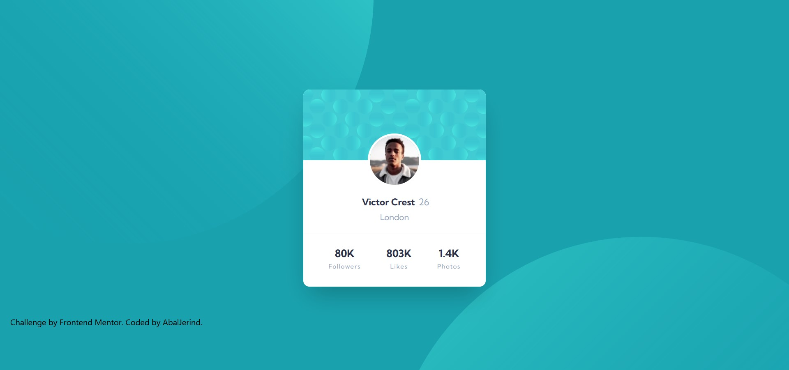
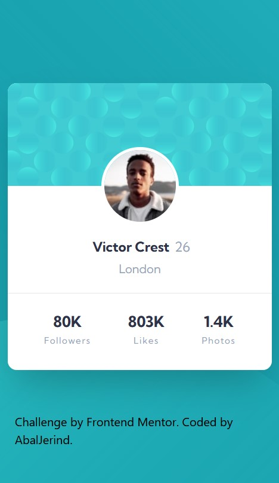

# Frontend Mentor - Profile card component solution

This is a solution to the [Profile card component challenge on Frontend Mentor](https://www.frontendmentor.io/challenges/profile-card-component-cfArpWshJ). Frontend Mentor challenges help you improve your coding skills by building realistic projects.

## Table of contents

- [Overview](#overview)
  - [The challenge](#the-challenge)
  - [Screenshot](#screenshot)
  - [Links](#links)
- [My process](#my-process)
  - [Built with](#built-with)
  - [What I learned](#what-i-learned)
  - [Continued development](#continued-development)
  - [Useful resources](#useful-resources)
- [Author](#author)
- [Acknowledgments](#acknowledgments)

## Overview

### The challenge

- Build out the project to the designs provided

### Screenshot

- Desktop version.
  

- Mobile version.
  

### Links

- Solution URL: [Source code on Github](https://github.com/Abaljerind/profile-card-component)
- Live Site URL: [Product Preview Card Component](https://profile-card-component-git-main-abaljerind.vercel.app/)

## My process

### Built with

- Semantic HTML5 markup
- [TailwindCSS](https://tailwindcss.com/) - For styles

**Note: These are just examples. Delete this note and replace the list above with your own choices**

### What I learned

I really am proud with this one, i actually have no idea that i can use multiple background like this, and i really learn something new. Thanks frontendmentor.io XD

```html
<h1>Some code I'm proud of</h1>
```

```css
body {
  background: url(../images/bg-pattern-bottom.svg) bottom -800px right -200px no-repeat, url(../images/bg-pattern-top.svg) top -500px left -250px no-repeat;
  background-color: hsl(185, 75%, 39%);
}
```

### Continued development

Well, actually for the background in mobile devices i still can't figure how to use it with TailwindCSS, so yes, maybe in the future if i know what i have to do, i would love to give it a try.

### Useful resources

- [TailwindCSS](https://tailwindcss.com/) - This helped me to do the styling more easy. I really liked this framework and will use it going forward.
- [Vercel](https://vercel.com) - This is an amazing website which helped me to upload my website into the internet. I'd recommend it to anyone who is still learning to use this website.

## Author

- Website - [AbalJerind](https://profile-card-component-git-main-abaljerind.vercel.app/)
- Frontend Mentor - [@Abaljerind](https://www.frontendmentor.io/profile/Abaljerind)

## Acknowledgments

I want to thank me for believing in me, I want to thank me for doing all this hard work. I wanna thank me for having no days off. I wanna thank me for never quitting. I wanna thank me for being me at all times.
